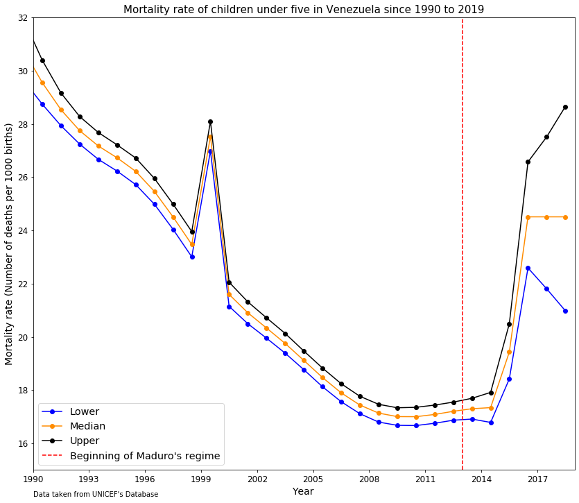

# Homework 8:

The image represents the mortality rate of children under five years old in Venezuela from the year 1990 to 2019. The graph also displays the moment when the current regime started, in order to show the increase of mortality rate in the past six years due to the ongoing venezuelan crisis. 
