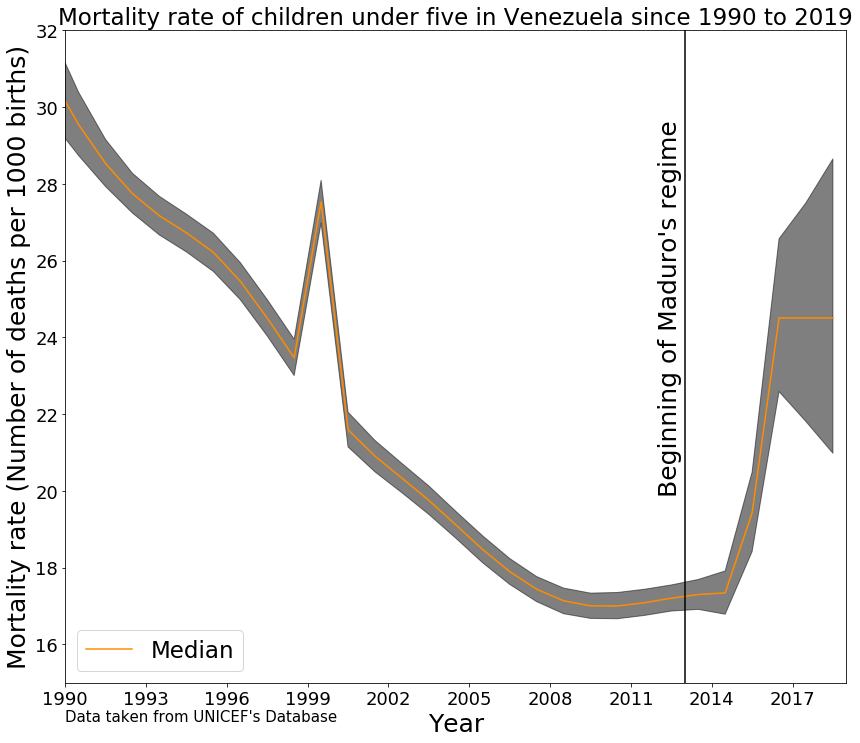

This is a very compelling and powerful graph! the data is really dramatic, and extremely convincing! 

The choice of displaying both points and line is however distracting and the upper-lower-and median would be better conveyed with a fill-between. This would allow you a graphical element for the epoch mark of when Maduro came to power, as w black solid line, which would be more powerful than the dashed red line. 

Good that you included the source of the data in the figure!

I recommand some changes in [this notebook](https://github.com/vicaleram/DSPS_VRamirez/blob/master/HW8/Copy_of_Homework8.ipynb) that lead to [this figure](download.png)

